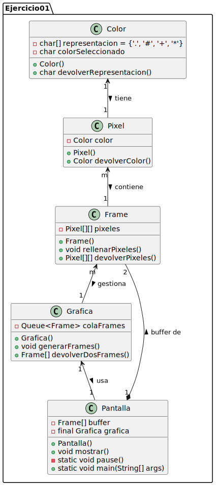
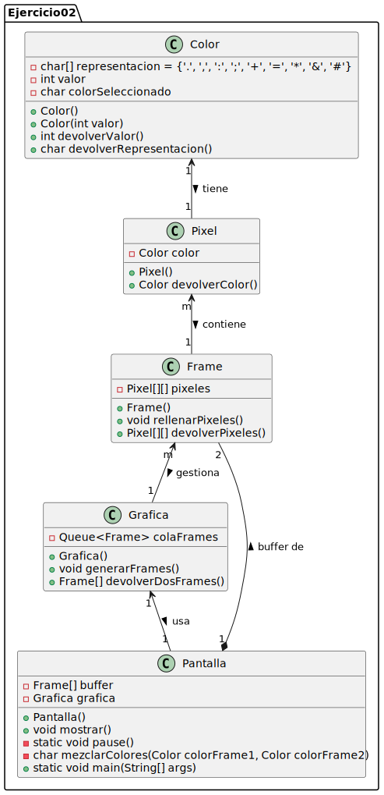

# Documentación

<strong> En ambas implementaciones se han usado arraylist</strong>

- <strong>Color</strong>: Representa un color individual con un valor y una representación de carácter.
- <strong>Pixel</strong>: Contiene un color y sirve como unidad básica de la pantalla.
- <strong>Frame</strong>: Matriz de 3x7 píxeles que forma un fotograma.
- <strong>Grafica</strong>: Gestiona una cola de frames para su procesamiento.
- <strong>Pantalla</strong>: Muestra los frames mezclando sus colores según una tabla de combinaciones.

## Funcionamiento

1. Se generan frames con colores aleatorios
2. Se toman dos frames de la cola
3. Se mezclan los colores de cada posición usando la tabla de combinaciones
4. Se muestra el resultado en la consola

### Ejercicio 01

- Los índices 0-3 representan los valores de color (1-4) restando 1
- El resultado se obtiene de tablaCombinaciones[valorColor1][valorColor2]

## Ejercicio 02

- Valores de color de 0 a 3 (en lugar de 1 a 4)
- Mezcla de colores mediante suma de valores (0-8)
- Nueva tabla de representaciones para 9 posibles resultados
- Constructor adicional para crear colores a partir de valores

# Diagramas
| Diagrama 1| Diagrama 2 |
|-----------|-----------|
|    |  |