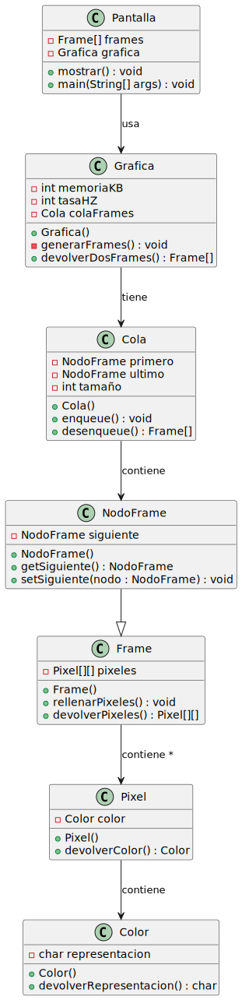

# RETO-001

| Ejercicio 1 (aumento de resolución)| Ejercicio 2 (superposición de colores)|
|-----------|-----------|
|    |     |
| [Código UML](Diagramas/diagrama.puml)    | [Código UML](Diagramas/diagrama2.puml)    |