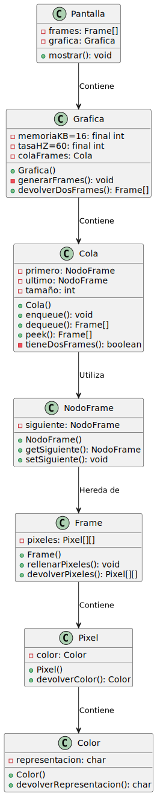

# Propuesta de diseño del examen final de EDA I

| Diseño                |
|-----------------------|
|  |
| [PUML](diagrama/diagrama.puml) |

| Código                |
|-----------------------|
| [Código](src) |

Tras el intento de implementación de esta propuesta me he dado cuenta de algunos errores que cometí durante el diseño, estos son:

1. La falta de un método `main` el cual iniciase el programa.
2. La falta de un parámetro de tipo `NodoFrame` en el método `setSiguiente()` de la clase [NodoFrame](src/NodoFrame.java), ya que no permite la actualización de la referencia `NodoFrame ultimo` de la clase [Cola](src/Cola.java) lo que conlleva a su no utilización.
3. Este diseño estaba basado en la idea de que la `Grafica` generaba frames y los almacenaba en su `Cola` a la vez que la `Pantalla` comprueba constantemente la `Cola` de frames que genera esta `Grafica`, y, si hay dos frames como mínimo, se eliminan de esta, se guardan en un buffer que almacena la `Pantalla` y se usan para mostrarlos. Este planteamiento evidentemente requiere la existencia de dos hilos de ejecución simultáneos, lo cual no se ha visto en clase pero durante el diseño no me dí cuenta.
