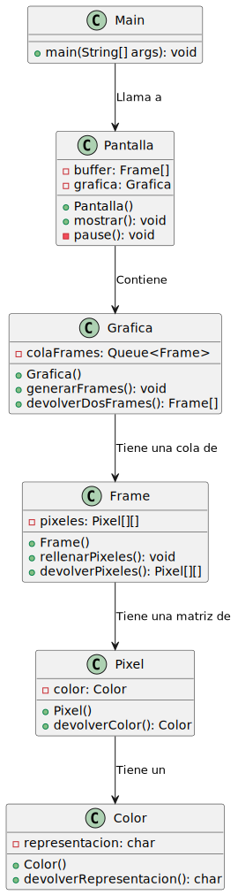
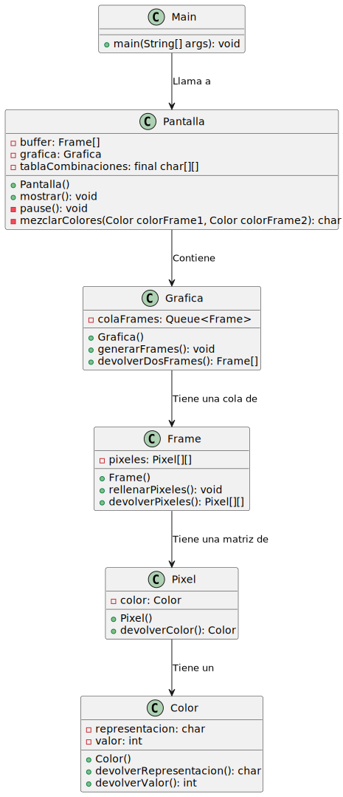

# Ejercicio 12/02/2025

| Ejercicio 1 (aumento de resolución)| Ejercicio 2 (superposición de colores)|
|-----------|-----------|
|    |     |
| [Código UML](diagramas/diagramaEjercicio1/diagrama.puml)    | [Código UML](diagramas/diagramaEjercicio2/diagrama.puml)    |
| [Código](src/srcEjercicio1)    | [Código](src/srcEjercicio2)     |
