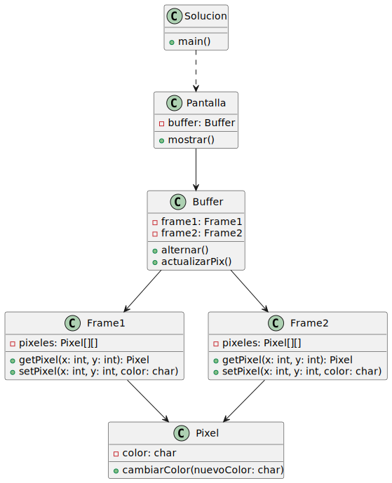

# 📌 Diagrama UML - Sistema de Doble Buffer CGA

## 📜 Descripción

Este diagrama UML representa la estructura de un sistema de visualización basado en doble buffer y modo entrelazado.

### 🏗️ Clases Principales

- **Pantalla**: Controla la visualización y contiene un `Buffer`.
- **Buffer**: Administra los dos frames (`Frame1` y `Frame2`) y permite alternar entre ellos.
- **Frame1 y Frame2**: Representan los dos buffers de 320x200 píxeles, almacenando información en una matriz de `Pixel`.
- **Pixel**: Representa un punto en la pantalla, con un color modificable.
- **Solucion**: Clase principal que inicia la simulación.

### 🔗 Relaciones entre clases

- `Pantalla` contiene un `Buffer`.
- `Buffer` maneja `Frame1` y `Frame2`.
- `Frame1` y `Frame2` heredan de `Frame` (jerarquía de clases).
- `Frame` almacena una matriz de `Pixel`, permitiendo manipular colores.
- `Solucion` interactúa con `Pantalla` para ejecutar el sistema.

### 🖼️ Diagrama UML

